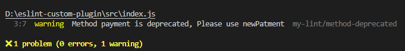

## Steps to add plugins in eslint
pre-requities - we should have javascript running with eslit

1. Create packages folder,inside packages create eslintrule folder
2. initilize node project inside eslintrule with name 'eslint-plugin-my-lint'. 
    Note - to create custom plugin name of plugin look like [eslint-plugin-{pulgin_name_here}]
3. Create an index.js file inside the packages/eslint directory.
4. create an deprecatedMethodRule.js inside the packages/eslint directory
References - https://dev.to/devsmitra/how-to-create-a-custom-eslint-plugin-3bom
5. go ack to your root folder of the project 
6. once will step 3 and step 4 file with proper code add those to dependency in package.json
        npm i file:packages/eslintrule -D
7. Update .eslintric.js
8. run eslint report
